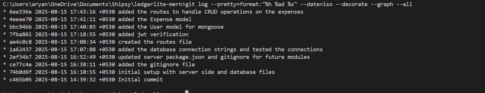
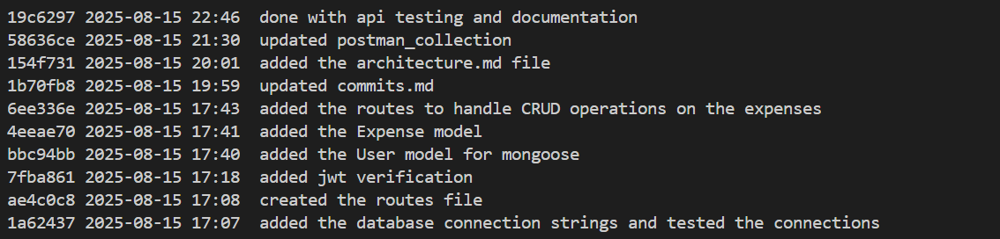
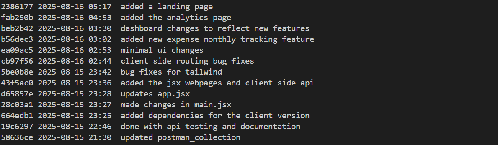

# Commit History

 

## Initial development (first ~12 commits)

  
### Checkpoint descriptions:
1. **c465b05** — Initial commit with repository structure.  
2. **74b0d6f** — Added server-side and database boilerplate files.  
3. **ce77c4e** — Added `.gitignore` to exclude unnecessary files like `node_modules`.  
4. **2ef34b7** — Updated `package.json` and `.gitignore` for future server modules.  
5. **1a62437** — Added MongoDB connection strings and successfully tested the database connection.  
6. **ae4c0c8** — Created base route files for API endpoints.  
7. **7fba861** — Implemented JWT verification middleware for authentication.  
8. **bbc94bb** — Added User model with password hashing for secure login.  
9. **4eeae70** — Added Expense model with schema and validation logic.  
10. **6ee336e** — Implemented routes to handle CRUD operations for expenses
11. **4eeae70** -Added the Expense model

## Further development (next ~10 commits)

### Checkpoint descriptions:
1. **19c6297** — Done with API testing and documentation.  
2. **58636ce** — Updated Postman collection.  
3. **154f731** — Added the architecture.md file.  
4. **1b70fb8** — Updated commits.md.  

## Client & Analytics (next ~15 commits)

### Checkpoint descriptions:
1. **1b70fb8** — Updated `commits.md`.
2. **154f731** — Added `architecture.md`.
3. **58636ce** — Updated Postman collection.
4. **19c6297** — Finished API testing and documentation.

5. **664edb1** — Added dependencies for the client.
6. **28c03a1** — Updated `main.jsx`.
7. **d65857e** — Updated `App.jsx`.
8. **43f5ac0** — Added JSX pages and client-side API wrappers.
9. **5be0b8e** — Tailwind bug fixes.
10. **cb97f56** — Client-side routing bug fixes.
11. **ea09ac5** — Minimal UI changes.
12. **b56dec3** — Added monthly tracking (backend `from`/`to` support + client params).
13. **beb2b42** — Dashboard updates to reflect new features (filters, stats).
14. **fab250b** — Added the Analytics page (charts for time, category, reimbursement).
15. **2386177** — Added the Landing page (hero + feature cards + CTA).

